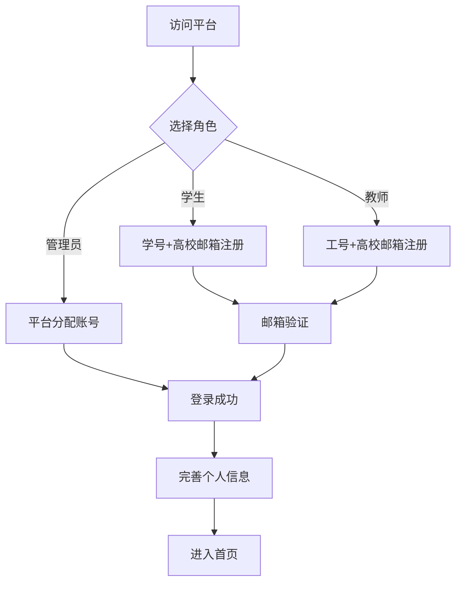
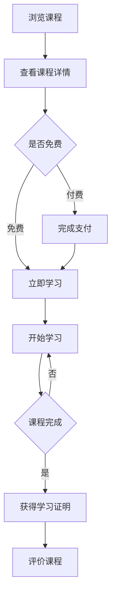
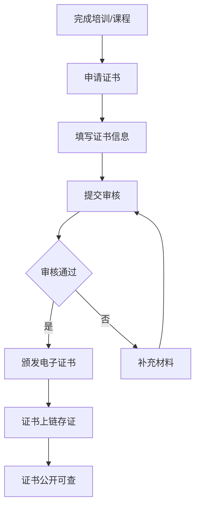

# 集团高校培训商场 - 产品需求文档

## 1. 产品概述
面向集团内高校学校开放的综合性培训商场平台，为高校师生提供证书展示、课程学习、培训报名等一站式服务。平台整合优质培训资源，促进高校间的学术交流与人才培养。

核心价值：
- 汇聚集团内多所高校的优质培训资源
- 提供证书在线展示与认证服务
- 支持在线学习和培训报名全流程
- 建立高校间的培训资源共享机制

## 2. 核心功能

### 2.1 用户角色

| 角色 | 注册方式 | 核心权限 |
|------|---------|----------|
| 学生 | 高校邮箱注册/学号绑定 | 浏览课程、报名培训、获取证书、学习课程 |
| 教师 | 高校邮箱注册/工号绑定 | 发布课程、管理培训、颁发证书 |
| 管理员 | 平台统一分配 | 平台运营、用户管理、数据统计 |

### 2.2 功能模块

1. **首页模块**
   - 轮播图展示热门培训项目
   - 分类导航（按学科、学校、证书类型）
   - 热门课程推荐
   - 最新培训动态
   - 优秀学员/证书展示

2. **课程中心**
   - 课程列表（筛选、排序、搜索）
   - 课程详情（介绍、大纲、讲师）
   - 在线学习功能
   - 课程评价与反馈

3. **证书中心**
   - 证书展示大厅
   - 证书详情查询
   - 证书在线验证
   - 证书下载/分享

4. **培训报名**
   - 培训项目列表
   - 报名流程管理
   - 报名状态追踪
   - 培训通知推送

5. **个人中心**
   - 个人信息管理
   - 我的课程
   - 我的证书
   - 学习记录
   - 报名记录

## 3. 核心流程

### 3.1 用户注册登录流程

### 3.2 课程学习流程

### 3.3 证书注册流程

## 4. 用户界面设计

### 4.1 设计风格
- **主题风格**: 学术蓝+科技感的现代教育风格
- **色彩方案**:
  - 主色调: #1E3A5F (深蓝) - 传递学术严谨
  - 辅色调: #00D4AA (青绿) - 代表成长与活力
  - 强调色: #FF6B35 (橙红) - 用于CTA按钮和重要提示
  - 背景色: #F8FAFC (浅灰白)
  - 文字色: #1F2937 (深灰)
- **按钮风格**: 圆角矩形，悬停阴影效果
- **字体选择**:
  - 标题: 思源黑体/Noto Sans SC Bold
  - 正文: 思源黑体/Noto Sans SC Regular
  - 数字: DIN Alternate
- **布局风格**: 卡片式布局，清晰的网格结构
- **图标风格**: 线性图标，统一2px描边

### 4.2 页面设计

#### 首页设计
| 模块 | UI元素 | 样式描述 |
|------|--------|----------|
| 导航栏 | Logo、搜索框、导航菜单、用户头像 | 固定顶部，毛玻璃效果 |
| 轮播区 | 3-5张Banner，指示器 | 全宽设计，渐变遮罩 |
| 分类导航 | 8个学科分类卡片 | 圆形图标，悬停放大 |
| 热门课程 | 课程卡片列表 | 封面图+标题+机构+价格 |
| 证书展示 | 横向滚动证书墙 | 3D透视效果 |
| 统计数据 | 合作高校数、课程数、学员数 | 数字跳动动画 |

#### 课程中心设计
| 模块 | UI元素 | 样式描述 |
|------|--------|----------|
| 筛选栏 | 分类、机构、证书类型、排序 | 标签式筛选器 |
| 课程网格 | 课程卡片瀑布流 | 封面、标题、机构、评价、价格 |
| 课程详情 | 视频预告、课程大纲、讲师介绍、用户评价 | 标签页切换 |

#### 证书中心设计
| 模块 | UI元素 | 样式描述 |
|------|--------|----------|
| 证书画廊 | 证书网格展示 | 证书模板预览，3D翻页效果 |
| 证书验证 | 验证码输入、查询按钮 | 简洁表单，即时反馈 |
| 证书详情 | 证书全图、持有人信息、颁发机构 | 弹出层展示 |

### 4.3 响应式设计
- **桌面端**: 1440px+ 宽屏展示，4列课程网格
- **平板端**: 768px-1439px，3列网格，侧边栏收起
- **移动端**: <768px，单列布局，底部导航栏

## 5. 数据统计指标

| 指标 | 描述 |
|------|------|
| PV/UV | 平台访问量 |
| 课程完成率 | 课程完成人数/报名人数 |
| 证书颁发量 | 各类型证书颁发统计 |
| 用户活跃度 | 日活、月活用户数 |
| 培训满意度 | 用户评价平均分 |
