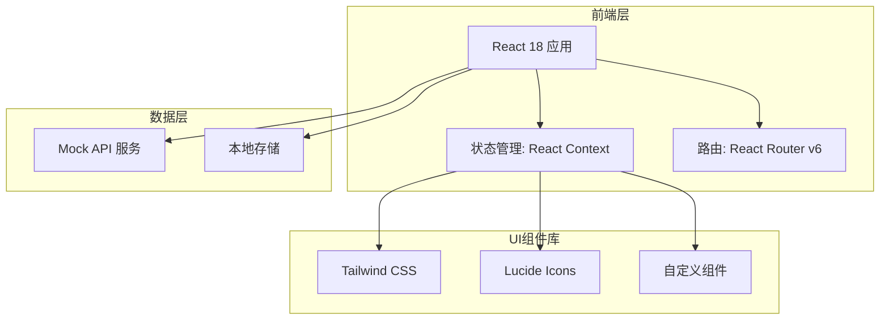
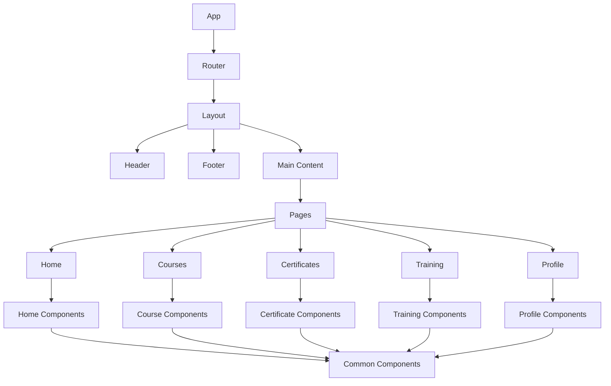

# 集团高校培训商场 - 技术架构文档

## 1. 架构设计



## 2. 技术选型

- **前端框架**: React 18
- **构建工具**: Vite
- **样式方案**: Tailwind CSS
- **图标库**: Lucide React
- **路由管理**: React Router DOM v6
- **状态管理**: React Context + useReducer
- **数据模拟**: Mock.js + 本地JSON数据
- **动画效果**: CSS Animations + Tailwind Animate

## 3. 路由定义

| 路由 | 页面名称 | 功能描述 |
|------|---------|----------|
| `/` | 首页 | 平台入口，展示轮播、热门课程、分类导航 |
| `/courses` | 课程中心 | 课程列表页，支持筛选和搜索 |
| `/courses/:id` | 课程详情 | 课程介绍、学习内容、讲师信息 |
| `/certificates` | 证书中心 | 证书展示、查询、验证 |
| `/certificates/:id` | 证书详情 | 单个证书详细信息展示 |
| `/training` | 培训报名 | 培训项目列表和报名管理 |
| `/training/:id` | 培训详情 | 培训项目详情和报名入口 |
| `/profile` | 个人中心 | 用户信息、我的课程、我的证书 |
| `/learning/:id` | 学习页面 | 在线课程学习界面 |

## 4. 页面结构

```
src/
├── components/
│   ├── layout/
│   │   ├── Header.jsx          # 顶部导航栏
│   │   ├── Footer.jsx          # 底部信息栏
│   │   ├── Sidebar.jsx         # 侧边栏
│   │   └── MobileNav.jsx       # 移动端底部导航
│   ├── common/
│   │   ├── Button.jsx          # 按钮组件
│   │   ├── Card.jsx            # 卡片组件
│   │   ├── Modal.jsx           # 弹窗组件
│   │   ├── Badge.jsx           # 标签组件
│   │   ├── Avatar.jsx          # 头像组件
│   │   ├── Input.jsx           # 输入框组件
│   │   ├── Select.jsx          # 选择器组件
│   │   ├── Tabs.jsx            # 标签页组件
│   │   └── Loading.jsx         # 加载状态组件
│   ├── home/
│   │   ├── Banner.jsx          # 轮播图组件
│   │   ├── CategoryNav.jsx     # 分类导航
│   │   ├── HotCourses.jsx      # 热门课程
│   │   ├── CertificateWall.jsx # 证书墙
│   │   └── Stats.jsx           # 数据统计
│   ├── courses/
│   │   ├── CourseCard.jsx      # 课程卡片
│   │   ├── CourseFilter.jsx    # 课程筛选
│   │   ├── CourseList.jsx      # 课程列表
│   │   ├── CourseContent.jsx   # 课程内容
│   │   └── CourseReview.jsx    # 课程评价
│   ├── certificates/
│   │   ├── CertificateCard.jsx # 证书卡片
│   │   ├── CertificateGallery.jsx # 证书画廊
│   │   ├── CertificateViewer.jsx   # 证书查看器
│   │   └── CertificateVerify.jsx   # 证书验证
│   ├── training/
│   │   ├── TrainingCard.jsx    # 培训卡片
│   │   ├── TrainingList.jsx    # 培训列表
│   │   ├── TrainingForm.jsx    # 报名表单
│   │   └── TrainingStatus.jsx # 报名状态
│   └── profile/
│       ├── ProfileHeader.jsx   # 用户信息头部
│       ├── MyCourses.jsx       # 我的课程
│       ├── MyCertificates.jsx  # 我的证书
│       └── LearningHistory.jsx # 学习记录
├── pages/
│   ├── Home.jsx                # 首页
│   ├── Courses.jsx             # 课程中心
│   ├── CourseDetail.jsx        # 课程详情
│   ├── Certificates.jsx        # 证书中心
│   ├── CertificateDetail.jsx   # 证书详情
│   ├── Training.jsx            # 培训报名
│   ├── TrainingDetail.jsx      # 培训详情
│   ├── Profile.jsx             # 个人中心
│   └── Learning.jsx            # 学习页面
├── contexts/
│   ├── AuthContext.jsx         # 认证状态管理
│   ├── CourseContext.jsx       # 课程数据管理
│   └── AppContext.jsx          # 全局应用状态
├── data/
│   ├── courses.json            # 课程数据
│   ├── certificates.json        # 证书数据
│   ├── training.json            # 培训数据
│   ├── universities.json        # 高校数据
│   └── users.json               # 用户数据
├── hooks/
│   ├── useAuth.js              # 认证相关钩子
│   ├── useCourses.js           # 课程相关钩子
│   └── useCertificates.js       # 证书相关钩子
├── utils/
│   ├── api.js                  # API请求封装
│   ├── storage.js              # 本地存储工具
│   └── helpers.js              # 辅助函数
├── styles/
│   └── index.css               # 全局样式
├── App.jsx                     # 应用入口
└── main.jsx                    # React渲染入口
```

## 5. 核心数据模型

### 5.1 课程数据模型

```javascript
{
  id: "course_001",
  title: "人工智能导论",
  subtitle: "从基础到实践",
  coverImage: "/images/courses/ai-intro.jpg",
  university: "清华大学",
  instructor: {
    name: "张教授",
    avatar: "/images/avatars/zhang.jpg",
    title: "计算机系教授"
  },
  category: "人工智能",
  certificateType: "结业证书",
  price: 299,
  originalPrice: 599,
  rating: 4.8,
  studentCount: 1256,
  duration: "32课时",
  level: "初级",
  tags: ["AI", "机器学习", "入门"],
  description: "本课程系统介绍人工智能的基本概念...",
  syllabus: [
    { chapter: 1, title: "人工智能概述", duration: "2课时" },
    { chapter: 2, title: "机器学习基础", duration: "4课时" }
  ],
  reviews: [
    { user: "学生A", rating: 5, comment: "课程很实用", date: "2024-01-15" }
  ],
  createdAt: "2024-01-01"
}
```

### 5.2 证书数据模型

```javascript
{
  id: "cert_001",
  title: "人工智能导论结业证书",
  type: "结业证书",
  holder: {
    name: "李同学",
    studentId: "2021001234",
    university: "北京大学"
  },
  issuer: {
    name: "清华大学",
    department: "计算机科学与技术系"
  },
  course: {
    id: "course_001",
    name: "人工智能导论"
  },
  issueDate: "2024-02-01",
  expiryDate: null,
  verifyCode: "ABC123XYZ",
  status: "有效",
  description: "该学员已成功完成人工智能导论课程..."
}
```

### 5.3 培训数据模型

```javascript
{
  id: "train_001",
  title: "2024年春季高校教师研修班",
  coverImage: "/images/training/teacher-2024.jpg",
  organizer: "清华大学继续教育学院",
  category: "教师培训",
  targetAudience: "高校教师",
  location: "北京市海淀区",
  mode: "线下",
  startDate: "2024-03-01",
  endDate: "2024-03-15",
  capacity: 50,
  enrolled: 35,
  price: 5000,
  status: "报名中",
  description: "本研修班旨在提升高校教师的专业能力...",
  schedule: [
    { day: 1, topic: "开班典礼", speaker: "校领导" },
    { day: 2, topic: "教学理论", speaker: "王教授" }
  ],
  requirements: ["高校在职教师", "本科及以上学历"],
  contact: {
    name: "张老师",
    phone: "010-12345678",
    email: "train@example.com"
  }
}
```

### 5.4 用户数据模型

```javascript
{
  id: "user_001",
  role: "student",
  profile: {
    name: "李同学",
    email: "student@uni.edu.cn",
    studentId: "2021001234",
    university: "北京大学",
    faculty: "计算机科学与技术",
    avatar: "/images/avatars/student.jpg",
    phone: "138****5678"
  },
  enrolledCourses: ["course_001", "course_002"],
  completedCourses: ["course_003"],
  certificates: ["cert_001", "cert_002"],
  trainingRecords: ["train_001"],
  preferences: {
    favoriteCategories: ["人工智能", "数据分析"],
    notifications: true
  },
  createdAt: "2024-01-01"
}
```

## 6. 组件层级关系



## 7. 响应式断点

| 断点 | 屏幕宽度 | 布局策略 |
|------|---------|----------|
| xs | < 640px | 移动端单列布局，底部导航 |
| sm | 640px - 767px | 小平板双列布局 |
| md | 768px - 1023px | 平板三列布局 |
| lg | 1024px - 1279px | 桌面四列布局 |
| xl | >= 1280px | 大屏幕优化，五列布局 |

## 8. 性能优化策略

- 路由懒加载，按需渲染页面组件
- 图片资源懒加载，减少首屏加载时间
- CSS Tailwind 按需编译，减少包体积
- 本地缓存热门数据，减少重复请求
- 骨架屏加载优化用户体验

## 9. 无障碍设计

- 语义化HTML标签
- ARIA属性支持
- 键盘导航支持
- 颜色对比度符合WCAG 2.1 AA标准
- 焦点状态可见性

## 10. 开发规范

- 组件命名: PascalCase (如 CourseCard.jsx)
- 样式类名: Tailwind CSS utilities
- 图片资源: 统一放在 public/images/ 目录
- Mock数据: 统一放在 src/data/ 目录
- 注释语言: 中文
