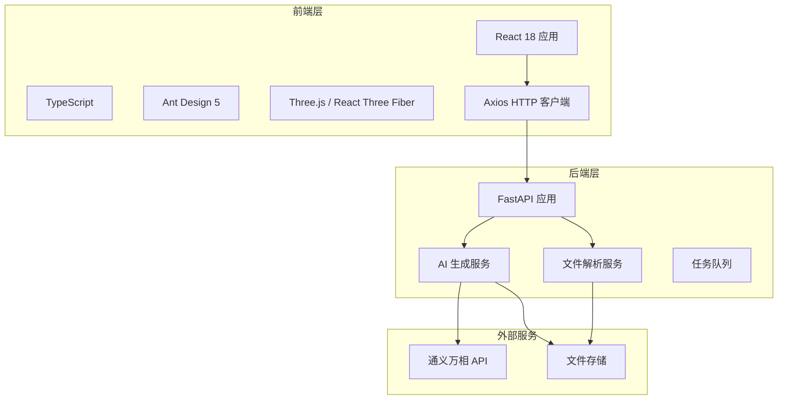
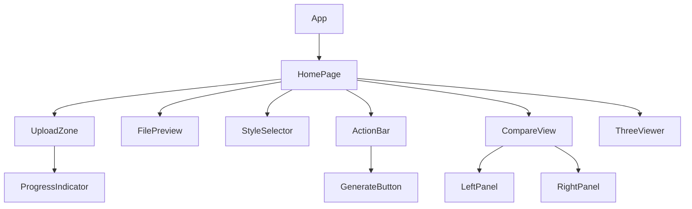

# 户型图 AI 生成装修效果图 - 技术架构文档

## 1. 系统架构



## 2. 技术选型

### 2.1 后端技术栈

| 技术 | 版本 | 用途 |
|------|------|------|
| Python | 3.10+ | 运行环境 |
| FastAPI | 0.104+ | Web 框架 |
| Uvicorn | 0.24+ | ASGI 服务器 |
| python-multipart | 0.0.6+ | 文件上传 |
| Pillow | 10.0+ | 图片处理 |
| pdf2image | 1.16+ | PDF 转换 |
| ezdxf | 1.0+ | DXF 解析 |
| matplotlib | 3.8+ | CAD 渲染 |
| pydantic | 2.0+ | 数据验证 |
| requests | 2.31+ | HTTP 请求 |
| python-dotenv | 1.0+ | 环境变量 |

### 2.2 前端技术栈

| 技术 | 版本 | 用途 |
|------|------|------|
| React | 18.2+ | UI 框架 |
| TypeScript | 5.0+ | 类型安全 |
| Vite | 5.0+ | 构建工具 |
| Ant Design | 5.12+ | UI 组件库 |
| Three.js | 0.160+ | 3D 渲染 |
| @react-three/fiber | 8.15+ | React Three.js 封装 |
| @react-three/drei | 9.88+ | Three.js 工具集 |
| Axios | 1.6+ | HTTP 客户端 |

## 3. 项目目录结构

```
floorplan-render/
├── backend/
│   ├── app/
│   │   ├── __init__.py
│   │   ├── main.py              # FastAPI 入口
│   │   ├── config.py            # 配置管理
│   │   ├── models.py            # Pydantic 模型
│   │   ├── routes/
│   │   │   ├── __init__.py
│   │   │   ├── upload.py         # 文件上传路由
│   │   │   ├── generate.py       # AI 生成路由
│   │   │   └── files.py          # 文件访问路由
│   │   ├── services/
│   │   │   ├── __init__.py
│   │   │   ├── parser_service.py  # 文件解析服务
│   │   │   ├── pdf_parser.py      # PDF 解析
│   │   │   ├── cad_parser.py     # CAD 解析
│   │   │   ├── image_processor.py # 图片处理
│   │   │   └── ai_service.py      # AI 生成服务
│   │   └── utils/
│   │       ├── __init__.py
│   │       └── helpers.py         # 辅助函数
│   ├── uploads/                   # 上传文件目录
│   ├── outputs/                   # 生成文件目录
│   └── requirements.txt
├── frontend/
│   ├── src/
│   │   ├── main.tsx
│   │   ├── App.tsx
│   │   ├── vite-env.d.ts
│   │   ├── api/
│   │   │   └── client.ts          # API 客户端
│   │   ├── components/
│   │   │   ├── UploadZone.tsx     # 上传区域
│   │   │   ├── FilePreview.tsx    # 文件预览
│   │   │   ├── StyleSelector.tsx  # 风格选择
│   │   │   ├── CompareView.tsx    # 对比视图
│   │   │   ├── RenderResult.tsx   # 生成结果
│   │   │   └── ThreeViewer.tsx    # 3D 预览
│   │   ├── pages/
│   │   │   └── Home.tsx           # 首页
│   │   ├── styles/
│   │   │   └── index.css
│   │   └── types/
│   │       └── index.ts           # 类型定义
│   ├── index.html
│   ├── package.json
│   ├── tsconfig.json
│   ├── vite.config.ts
│   └── .env.example
├── uploads/                       # 共享上传目录
├── outputs/                       # 共享输出目录
├── README.md
└── start.sh                       # 启动脚本
```

## 4. API 设计

### 4.1 上传文件

```
POST /api/upload
Content-Type: multipart/form-data

Request:
  file: File

Response:
{
  "code": 200,
  "message": "success",
  "data": {
    "file_id": "uuid-string",
    "type": "image|pdf|cad",
    "preview_url": "/api/files/xxx.png",
    "width": 1024,
    "height": 768,
    "page_count": 1,        // 仅 PDF
    "original_filename": "floorplan.png"
  }
}
```

### 4.2 生成效果图

```
POST /api/generate
Content-Type: application/json

Request:
{
  "file_id": "uuid-string",
  "style": "modern-minimalist|nordic|chinese-modern|light-luxury|industrial|japanese",
  "custom_prompt": "可选的自定义描述"
}

Response:
{
  "code": 200,
  "message": "success",
  "data": {
    "task_id": "uuid-string",
    "status": "pending"
  }
}
```

### 4.3 查询任务状态

```
GET /api/tasks/{task_id}

Response:
{
  "code": 200,
  "message": "success",
  "data": {
    "task_id": "uuid-string",
    "status": "pending|processing|completed|failed",
    "progress": 50,
    "output_url": "/api/files/result.png",  // 完成后
    "error": "错误信息"                       // 失败时
  }
}
```

### 4.4 获取文件

```
GET /api/files/{filename}

Response: 文件二进制流
```

### 4.5 生成历史

```
GET /api/history

Response:
{
  "code": 200,
  "message": "success",
  "data": [
    {
      "task_id": "uuid",
      "file_id": "uuid",
      "style": "modern-minimalist",
      "status": "completed",
      "output_url": "/api/files/result.png",
      "created_at": "2024-01-01T12:00:00Z"
    }
  ]
}
```

## 5. 数据模型

### 5.1 上传文件元数据

```python
class UploadedFile:
    file_id: str           # UUID
    original_filename: str # 原始文件名
    file_type: str         # image/pdf/cad
    stored_path: str       # 存储路径
    width: int             # 图片宽度
    height: int            # 图片高度
    page_count: int        # PDF 页数
    created_at: datetime
```

### 5.2 生成任务

```python
class RenderTask:
    task_id: str           # UUID
    file_id: str           # 关联的文件 ID
    style: str             # 装修风格
    custom_prompt: str      # 自定义描述
    status: str            # pending/processing/completed/failed
    progress: int          # 0-100
    output_path: str       # 输出文件路径
    error: str             # 错误信息
    created_at: datetime
    completed_at: datetime
```

### 5.3 前端类型定义

```typescript
interface UploadResponse {
  file_id: string;
  type: 'image' | 'pdf' | 'cad';
  preview_url: string;
  width: number;
  height: number;
  page_count?: number;
  original_filename: string;
}

interface GenerateRequest {
  file_id: string;
  style: StyleType;
  custom_prompt?: string;
}

interface TaskStatus {
  task_id: string;
  status: 'pending' | 'processing' | 'completed' | 'failed';
  progress: number;
  output_url?: string;
  error?: string;
}

type StyleType = 'modern-minimalist' | 'nordic' | 'chinese-modern' | 
                 'light-luxury' | 'industrial' | 'japanese';
```

## 6. 文件处理流程

### 6.1 图片处理流程

```
JPG/PNG 文件
    │
    ▼
文件类型校验 (白名单)
    │
    ▼
大小限制检查 (50MB)
    │
    ▼
Pillow 打开图片
    │
    ▼
计算缩放比例 (最大边 1024px)
    │
    ▼
保存为 PNG
    │
    ▼
返回预览 URL
```

### 6.2 PDF 处理流程

```
PDF 文件
    │
    ▼
文件类型校验
    │
    ▼
pdf2image 转换 (第一页)
    │
    ▼
DPI 设置 (150 DPI)
    │
    ▼
PIL Image 对象
    │
    ▼
图片压缩处理
    │
    ▼
返回预览 URL + 页码信息
```

### 6.3 CAD 处理流程

```
DXF 文件
    │
    ▼
文件类型校验
    │
    ▼
ezdxf 打开 DXF
    │
    ▼
遍历 MODELSPACE 实体
    │
    ▼
提取 LINE, LWPOLYLINE, ARC, CIRCLE, TEXT, MTEXT
    │
    ▼
matplotlib 渲染
    │
    ▼
保存为 PNG
    │
    ▼
返回预览 URL + 几何数据
```

## 7. AI 生成流程

### 7.1 通义万相 API 调用

```python
# Prompt 构建
STYLE_PROMPTS = {
    "modern-minimalist": "Clean lines, neutral colors, functional furniture, contemporary design",
    "nordic": "Light woods, white tones, cozy textiles, Scandinavian aesthetic",
    "chinese-modern": "Traditional Chinese elements, elegant wood furniture, muted colors with red accents",
    "light-luxury": "Gold accents, marble textures, sophisticated lighting, luxurious materials",
    "industrial": "Exposed brick walls, metal fixtures, raw concrete, vintage Edison bulbs",
    "japanese": "Warm wood tones, tatami elements, minimalist Zen atmosphere, shoji screens"
}

def build_prompt(style: str, custom: str = "") -> str:
    base = "Professional interior design rendering based on architectural floor plan"
    style_desc = STYLE_PROMPTS.get(style, "")
    custom_desc = custom if custom else ""
    extras = "spatial layout preserved, furniture placement, natural lighting, photorealistic, 4k, architectural visualization"
    return f"{base}, {style_desc}, {custom_desc}, {extras}"
```

### 7.2 异步任务处理

```python
# 使用内存字典模拟任务队列（生产环境可使用 Redis）
TASKS = {}

def create_task(file_id: str, style: str, custom_prompt: str) -> str:
    task_id = str(uuid.uuid4())
    TASKS[task_id] = {
        "status": "pending",
        "progress": 0,
        "output_path": None,
        "error": None
    }
    # 异步执行生成
    asyncio.create_task(process_task(task_id, file_id, style, custom_prompt))
    return task_id
```

## 8. 前端组件设计

### 8.1 组件层级



### 8.2 状态管理

```typescript
interface AppState {
  uploadedFile: UploadResponse | null;
  selectedStyle: StyleType | null;
  currentTask: TaskStatus | null;
  renderResult: string | null;
  isLoading: boolean;
  error: string | null;
}
```

### 8.3 Three.js 场景配置

```typescript
// 场景设置
const scene = new THREE.Scene();
scene.background = new THREE.Color(0xf0f0f0);

// 相机
const camera = new THREE.PerspectiveCamera(
  75,
  container.clientWidth / container.clientHeight,
  0.1,
  1000
);
camera.position.set(5, 5, 5);

// 控制器
const controls = new OrbitControls(camera, renderer.domElement);
controls.enableDamping = true;
controls.dampingFactor = 0.05;

// 光照
const ambientLight = new THREE.AmbientLight(0xffffff, 0.6);
scene.add(ambientLight);

const directionalLight = new THREE.DirectionalLight(0xffffff, 0.8);
directionalLight.position.set(5, 10, 5);
scene.add(directionalLight);
```

## 9. 环境变量配置

### 9.1 后端 .env

```
TONGYI_API_KEY=sk-xxxxxxxxxxxxxxxxxxxxxxxxxxxx
UPLOAD_DIR=./uploads
OUTPUT_DIR=./outputs
MAX_FILE_SIZE=52428800
ALLOWED_EXTENSIONS=jpg,jpeg,png,pdf,dxf
```

### 9.2 前端 .env

```
VITE_API_BASE_URL=http://localhost:8000
```

## 10. 部署说明

### 10.1 系统依赖

```bash
# Ubuntu/Debian
sudo apt-get update
sudo apt-get install -y poppler-utils

# macOS
brew install poppler

# Windows
# 下载 poppler for Windows 并配置 PATH
```

### 10.2 启动命令

```bash
# 方式一: 一键启动
chmod +x start.sh
./start.sh

# 方式二: 手动启动
# 后端
cd backend
pip install -r requirements.txt
uvicorn app.main:app --host 0.0.0.0 --port 8000 --reload

# 前端
cd frontend
npm install
npm run dev
```

## 11. 错误处理

### 11.1 后端错误响应

```python
class APIResponse:
    @staticmethod
    def success(data: Any) -> dict:
        return {"code": 200, "message": "success", "data": data}

    @staticmethod
    def error(code: int, message: str) -> dict:
        return {"code": code, "message": message, "data": None}

    @staticmethod
    def file_type_error() -> dict:
        return APIResponse.error(400, "不支持的文件类型，请上传 JPG、PNG、PDF 或 DXF 格式")

    @staticmethod
    def file_size_error() -> dict:
        return APIResponse.error(400, "文件大小超过限制（最大 50MB）")

    @staticmethod
    def dwg_not_supported() -> dict:
        return APIResponse.error(400, "DWG 格式暂不支持，请转换为 DXF 格式后上传")

    @staticmethod
    def parse_timeout() -> dict:
        return APIResponse.error(408, "文件解析超时，请尝试更小的文件或简化图纸")
```

### 11.2 前端错误边界

```tsx
class ErrorBoundary extends React.Component {
  state = { hasError: false, error: null };

  static getDerivedStateFromError(error: Error) {
    return { hasError: true, error };
  }

  render() {
    if (this.state.hasError) {
      return (
        <div className="error-container">
          <h2>出错了</h2>
          <p>{this.state.error?.message}</p>
          <Button onClick={() => window.location.reload()}>重试</Button>
        </div>
      );
    }
    return this.props.children;
  }
}
```
